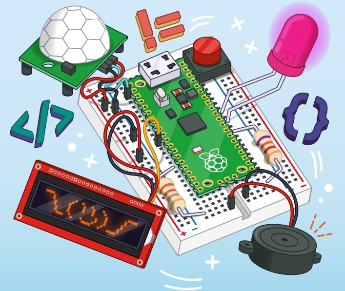
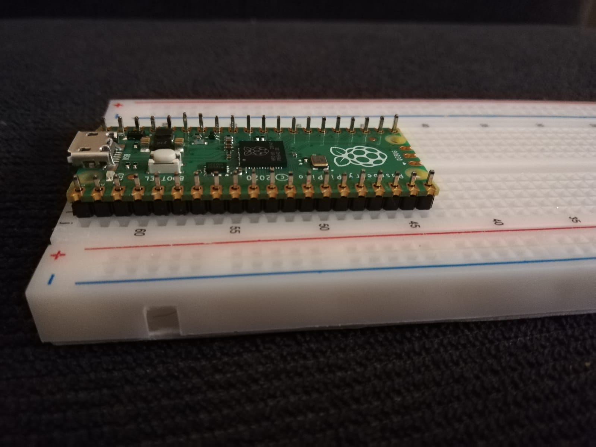
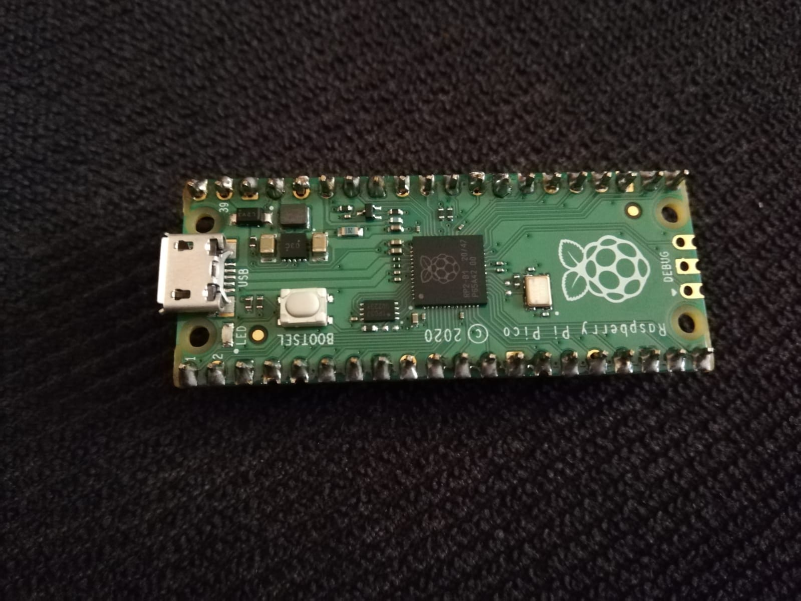
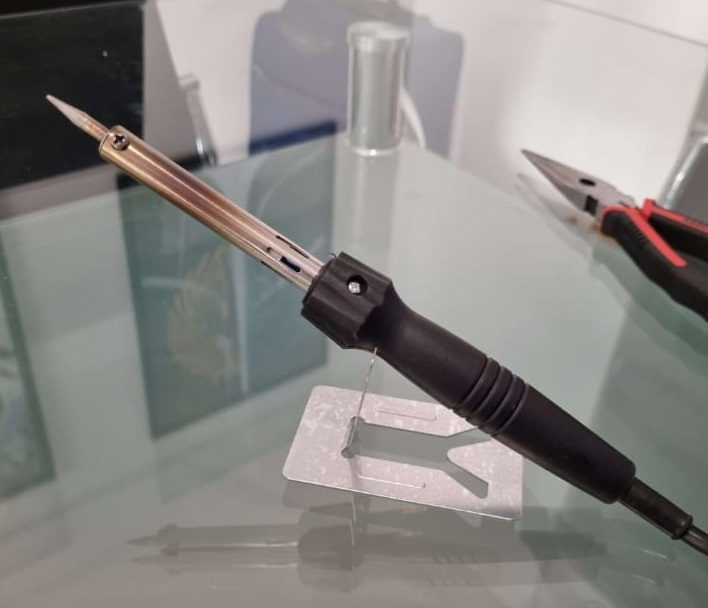

# First practice
---

1.	## Introduce pins and Raspberry Pi pico to the protoboard

.jpg)

2.	## The pins were soldered to the Raspebrry Pi pico board

## 3.	The Soldering Iron was “Kushiro” 220V, 60W, 50 Hz. 

