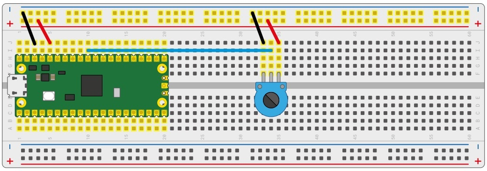

## Potentiometer as voltage divider
 

- The potentiometer was connected to the breadboard, using the potentiometer as a voltage divider.
- The pins were connected as shown in the picture

The micropython code was made where the red led light was requested to turn on when the analogue signal was less than or equal to 32768.

**MicroPython code**

    from machine import Pin, ADC
    from utime import sleep

    potentiometer = ADC(26)
    led_red = Pin(15, Pin.OUT)

    while(True):
        print(potentiometer.read_u16())
        sleep(5)
        if(potentiometer.read_u16() <= 32768):
            led_red.value(1)
        else:
            led_red.value(0)

We can obtain the analogue to digital signals, by means of the ADC, in terms of voltage from 0 [Volts] to 3.3 [Volts] and introduce the same conditional

**MicroPython Code:**

    from machine import Pin, ADC
    from utime import sleep

    potentiometer = ADC(26)
    led_rojo = Pin(15, Pin.OUT)
    convertion = 3.3 / (65535)

    while(True):
        voltage = potentiometer.read_u16() * convertion
        print(voltage)
        sleep(5)  
        if (voltage > 2.5):
            led_red.value(1)
        else:
            led_red.value(0)

---

# Temperature Measurement

- The RP2040 of the RPico has an internal temperature sensor, which is read through the fourth ADC channel of the microcontroller.
- The on-chip sensor does not use a GPIO pin for its implementation, we must indicate the channel number connected to the temperature sensor, in this case 4.

        temperature_sensor = ADC(4)

- I applied a conversion to change the value returned by the ADC (a 16-bit binary) to a voltage value (between 0 [Volts] and 3.3 [Volts]).
        convertion_factor = 3.3 / (65535)

- Then, set up a loop to take readings from the analogue input, apply the conversion factor to them and store them in a variable.

        lecture_temperature = temperature_sensor.read_u16() * convertion_factor

- Also, we must take this voltage and convert it to Degrees Celsius.

        celsius_grade = 27 - (lecture_temperature - 0.706)/0.001721

 
**MicroPython code**

    from machine import Pin, ADC
    from utime import sleep

    temperature_sensor = ADC(4)
    convertion_factor = 3.3/65535
    lecture_temperature = temperature_sensor.read_u16() * convertion_factor
    celsius_grade = 27 - (lecture_temperature - 0.706)/0.001721

    while(True):
        print(celsius_grade)
        sleep(3)

---

# Automatic PWM brightness control

- Red and green LED are set them on pin GP15 and GP 14 respectively, activating the PWM output on the pin, block B[7].

        led_red_PWM = PWM(Pin(15))
        led_green_PWM = PWM(Pin(14))	

- Continue setting up the frequency of our PWM signal. 
- We use the freq() method:

	        led_red_PWM.freq(1000)

To control the brightness of the LED, we can use 1000[Hz] without inconvenience, as the human eye is unable to detect such rapid changes.

**MicroPython Code:**

        from machine import Pin, PWM
        from utime import sleep

        led_red_PWM = PWM(Pin(15))
        led_green_PWM = PWM(Pin(14))

        led_red_PWM.freq(1000)
        val = 0

        while(True):
            while (val < 65535):
                val = val + 1000
                sleep(0.05)
                led_red_PWM.duty_u16(val)
                led_green_PWM.duty_u16(val)
                print(val)
                
            while(val > 0):
                val = val - 1000
                sleep(0.05)
                led_red_PWM.duty_u16(val)
                led_green_PWM.duty_u16(val)
                print(val)
        

Video shows the analogue/digital signal from the red and green LED in the MicroPython console

https://user-images.githubusercontent.com/107819898/208056631-195c739e-70a3-438d-ade8-68e409ed8db9.mp4

---
# Another experiment now with a Green LED

- It has changed the freq, the green counter and limit to make the breathing faster.

        from machine import Pin, PWM
        from utime import sleep

        green_led = PWM(Pin(14))
        green_led.freq(1000)

        # To turn the green Led off
        green_led.duty_u16(0)

        green_counter = 10000
        limit = 50000

        while(True):   
            while(green_counter < limit):
                green_counter += 5000
                green_led.duty_u16(green_counter)
                sleep(0.05)
                print(green_led.duty_u16())
                
            while(green_counter > 10000):
                green_counter-= 5000
                green_led.duty_u16(green_counter)
                sleep(0.05)
                print(green_counter)

https://user-images.githubusercontent.com/107819898/208056760-f6542139-02d7-453c-9b49-d68139010440.mp4

---

# First control system: Brightness control with ADC and PWM

Lets control the brightness of the LED with the potentiometer
With the potentiometer we regulate the PWM signal to LED, where previously took from the ADC the value of the potentiometer.

        from machine import ADC, PWM, Pin
        from utime import sleep

        potentiometer = ADC(26)
        red_led_PWM = PWM(Pin(15))

        # Led red Frequency
        red_led_PWM.freq(1000)

        # covertion voltage
        convertion = 3.3 / 65535

        # analogue - digital signal value
        value = potentiometer.read_u16()

        # voltage in total = lecture analogue - digital  * voltage
        convertion_potentiometer_to_voltage = value * convertion

        while(True):
            value = potentiometer.read_u16()
            convertion_potentiometer_to_voltage = value * convertion
            
            red_led_PWM.duty_u16(value)
            sleep(2)
            
            print("Value in analogue signal:")
            print(value)

            print("Value in voltage:")
            print(convertion_potentiometer_to_voltage)

https://user-images.githubusercontent.com/107819898/208056834-130a4e84-0ed0-4687-8c38-b9735b202f5d.mp4
