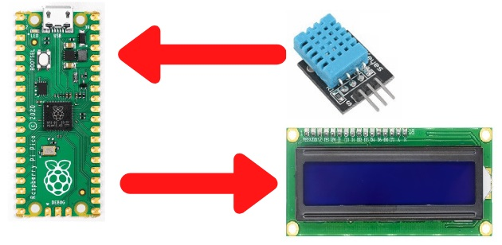

# Final Project
# *Temperature and Relative Humidity Monitoring*

- The final Project idea is to solve a real problem which consists of measuring two physical variables (in this case are the temperature and humidity), displaying the corresponding values on the LCD display, and issuing a warning signal at given a value
- For this purpose, I will use a temperature sensor and a humidity sensor DHT11 
- Datasheet DHT11 sensor: [DHT11 Humidity & Temperature Sensor](https://www.mouser.com/datasheet/2/758/DHT11-Technical-Data-Sheet-Translated-Version-1143054.pdf) 

---
## *DHT11 sensor: Pinout  and connection*

If we look at it head-on and list it from left to right:

1. The first pin is VCC, and we will connect it to the 5[Volts] or 3.3[Volts] of the RPico
2. On the other end we have pin 3 and it is the GND, which will be connected to a GND pin of the RPico. 
3. Pin 2 in te middle (DATA) which will give us the temperature and humidity information, must be connected to a digital input of the RPico.

An example of a connection is shown as follows.
1. the sensor power is taken from pin _3V3_ (physical pin 36).
2. _GND_ (physical pin 38), 
3. The data is read using the _GP28_ pin as input (physical pin 34).

---
## Import "dht" Library 

- If we introduce by console help("modules"), will appear many of library that we can use with MicroPython

- we import this library becase the whole process of transmitting values involves respecting certain start and end times for communication between the microcontroller and the sensor, so this can saves us a lot of time 

        	from dht import DHT11

 
- Then we create the DHT11 sensor objet

        dht11_sensor = DHT11(Pin(28,Pin.IN))

---

## Let's start !
## **Part I - Reading and measuring values**

- We have to use different methods to measure the values.
  1. method *measure()*
  2. method *temperature()*
  3. method *humidity()*

>
- Then, we save them in variables:

        dht11_sensor.measure()
        temperature = dht11_sensor.temperature()
        humidity = dht11_sensor.humidity()

**MicroPython code:**

        from machine import Pin
        from utime import sleep
        from dht import DHT11

        dht11_sensor = DHT11(Pin(28, Pin.IN))

        dht11_sensor.measure()
        temperature = dht11_sensor.temperature()
        humidity = dht11_sensor.humidity()

        while True:
            sleep(5)
            temperature = dht11_sensor.temperature()
            humidity = dht11_sensor.humidity()
            print("Temperature : ", temperature, "°C")
            print("Humidity : " , humidity , "%")
            print()

 

---

## **Part II - Viewing measured data** 

--
**MicroPython code**

            from machine import Pin, I2C
            from utime import sleep
            from dht import DHT11
            from lcd_api import LcdApi
            from pico_i2c_lcd import I2cLcd

            # -------- DHT11 Sensor --------
            dht11_sensor = DHT11(Pin(15, Pin.IN))

            dht11_sensor.measure()
            temperature = dht11_sensor.temperature()
            humidity = dht11_sensor.humidity()

            # -------- LCD display -------
            # I2C 
            scl = Pin(1)
            sda = Pin(0)
            freq = 400000

            i2c = I2C(0,sda=sda, scl=scl,freq=freq)

            I2C_ADDR = 0x27
            I2C_NUM_ROWS = 2
            I2C_NUM_COLS = 16

            #LCD object
            lcd = I2cLcd(i2c,I2C_ADDR,I2C_NUM_ROWS,I2C_NUM_COLS)

            while True:
                sleep(3)
                lcd.clear()
                temperature = dht11_sensor.temperature()
                lcd.move_to(0,0)
                lcd.putstr("Temp: ")
                lcd.putstr(str(temperature))
                lcd.putstr(chr(223)) 
                lcd.move_to(0,1)
                humidity = dht11_sensor.humidity()
                lcd.putstr("Humidity: ")
                lcd.putstr(str(humidity))
                lcd.putstr("%")

---
**The circuit :**    

---
## **Part III - Weather Station**

- Will incorporate an alarm signal, which is triggered when a certain condition occurs. 

### ***The condition to be fulfilled is that the alarm is triggered when the relative humidity exceeds 70%.***

 

1. Picture of the implemented circuit

---
2. MicroPytho code

            from machine import Pin, I2C
            from utime import sleep
            from dht import DHT11
            from lcd_api import LcdApi
            from pico_i2c_lcd import I2cLcd

            # Red LED
            led_red = Pin(14, Pin.OUT)

            # DHT11 Sensor
            dht11_sensor = DHT11(Pin(15, Pin.IN))

            dht11_sensor.measure()
            temperature = dht11_sensor.temperature()
            humidity = dht11_sensor.humidity()

            # -------- LCD display -------
            # I2C 
            scl = Pin(1)
            sda = Pin(0)
            freq = 400000

            i2c = I2C(0,sda=sda, scl=scl,freq=freq)

            I2C_ADDR = 0x27
            I2C_NUM_ROWS = 2
            I2C_NUM_COLS = 16

            #LCD object
            lcd = I2cLcd(i2c,I2C_ADDR,I2C_NUM_ROWS,I2C_NUM_COLS)

            while True:
                sleep(3)
                lcd.clear()
                temperature = dht11_sensor.temperature()
                lcd.move_to(0,0)
                lcd.putstr("Temp: ")
                lcd.putstr(str(temperature))
                lcd.putstr(chr(223)) 
                lcd.move_to(0,1)
                humidity = dht11_sensor.humidity()
                lcd.putstr("Humidity: ")
                lcd.putstr(str(humidity))
                lcd.putstr("%")
                if(humidity > 70 or temperature > 28) :
                    led_red.value(1)

---
3.  A short video demonstrating the correct operation of the _weather station_, showing the display of the data and the triggering of the alarm when the set condition is reached.

[link](img/WhatsApp%20Video%202022-12-18%20at%2004.18.24.mp4)
